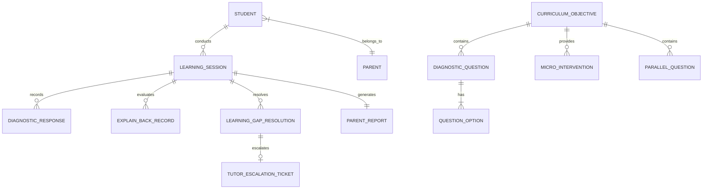

# TalkPDF — Data Structure Specification

**Document Version:** 1.0.0  
**Target Milestone:** Minimum Viable Learning-Resolution Loop (SS3 WAEC/JAMB)  
**Date:** 15 September 2026  
**Reference Document:** [requirements.md](file:///c:/Users/HomePC/Documents/Talkpdf/requirements.md) | [user-flow.md](file:///c:/Users/HomePC/Documents/Talkpdf/user-flow.md)

---

## Overview

This document provides a plain, comprehensive inventory of every "thing" (data entity) TalkPDF must remember to execute the MVP learning-gap resolution loop, evaluate active recall, track gap statuses, and deliver verifiable progress reports to parents.

---

## Entity Inventory (Plain List of "Things")

1. **Student (Candidate Profile)** — The SS3 exam candidate taking diagnostic tests and closing gaps.
2. **Parent (Economic Buyer / Guardian)** — The family sponsor who receives WhatsApp summaries and reports.
3. **Curriculum Objective (Syllabus Target)** — The WAEC/JAMB topic, rule, and rubric definition.
4. **Diagnostic Question** — A curriculum-mapped past-exam question used to diagnose misconceptions.
5. **Question Option & Misconception Tag** — An individual multiple-choice option pre-mapped to a likely learning gap.
6. **Targeted Micro-Intervention** — The 60–90 second plain-English explanation addressing the diagnosed gap.
7. **Learning Session** — The active study session tracking state from entry through completion.
8. **Diagnostic Response** — The record of a student's answer choice on a diagnostic question.
9. **Explain-Back Record** — The student's explanation text/audio, AI evaluation, and secondary feedback scores.
10. **Parallel Reassessment Question** — A fresh past-exam question testing the identical learning objective.
11. **Learning-Gap Resolution Record** — The empirical gap status (`PROVISIONALLY_RESOLVED` vs. `PERSISTENT_GAP`).
12. **Parent Progress Report & Secure Token** — The scorecard, WhatsApp message payload, and private web report link.
13. **Tutor Escalation Ticket** — A support request generated when a persistent gap requires human tutoring.

---

## Detailed Facts & Fields to Store per Entity

### 1. Student (`Student`)
*What it is:* The SS3 secondary school candidate preparing for WAEC or JAMB.
*Facts / Fields to store:*
* `student_id`: Unique identifier (UUID/string).
* `full_name`: Student's name (e.g., "Samuel Okon").
* `target_exam`: Target examination (`WAEC`, `JAMB`, or `BOTH`).
* `class_level`: Academic level (default: `SS3`).
* `phone_number`: Student's mobile number or shared family device number.
* `parent_id`: Reference to the linked Parent entity.
* `current_streak_count`: Number of consecutive gaps provisionally resolved (`FR-14`).
* `low_bandwidth_enabled`: Boolean flag indicating preference for text-first mode (`FR-08`).
* `created_at`: Account creation timestamp.
* `last_active_at`: Timestamp of latest study activity.

---

### 2. Parent (`Parent`)
*What it is:* The paying parent or guardian financing exam fees and receiving accountability updates.
*Facts / Fields to store:*
* `parent_id`: Unique identifier (UUID/string).
* `full_name`: Parent or guardian's name.
* `whatsapp_number`: Phone number formatted for WhatsApp dispatch (`FR-09`).
* `sms_number`: Fallback SMS mobile number.
* `relationship`: Relationship to student (e.g., Mother, Father, Guardian).
* `notification_opt_in`: Boolean indicating consent to receive WhatsApp progress alerts.
* `linked_student_ids`: List of associated Student IDs.
* `created_at`: Registration timestamp.

---

### 3. Curriculum Objective (`CurriculumObjective`)
*What it is:* A specific, granular syllabus objective defined in the official WAEC/JAMB syllabus.
*Facts / Fields to store:*
* `objective_id`: Unique identifier (e.g., `PHY-EM-001`).
* `exam_type`: Target exam (`WAEC` or `JAMB`).
* `subject`: Subject name (e.g., `Physics`, `Chemistry`, `Biology`).
* `topic`: Broad syllabus topic (e.g., `Electromagnetism`).
* `subtopic_title`: Specific objective title (e.g., `Faraday's Law of Electromagnetic Induction`).
* `objective_statement`: Formal syllabus requirement statement.
* `required_understanding_points`: List of human-defined key conceptual points required for active recall evaluation (`FR-05`). Example:
  1. *Magnetic flux must change relative to a conductor.*
  2. *Magnitude of induced EMF is proportional to rate of flux change.*
* `created_at`: Authoring timestamp.

---

### 4. Diagnostic Question (`DiagnosticQuestion`)
*What it is:* A 5-question assessment item used during initial diagnosis.
*Facts / Fields to store:*
* `question_id`: Unique identifier (UUID/string).
* `objective_id`: Reference to Curriculum Objective.
* `exam_source`: Past-exam origin metadata (e.g., `WASSCE 2022 Question 14`).
* `question_text`: Complete problem text and stimulus.
* `diagram_url`: Optional image URL for diagrams or circuit schematics.
* `correct_option`: Correct option key (`A`, `B`, `C`, or `D`).
* `created_at`: Authoring timestamp.

---

### 5. Question Option & Misconception Tag (`QuestionOption`)
*What it is:* Each individual choice (A, B, C, D) attached to a diagnostic question, pre-tagged with misconception data.
*Facts / Fields to store:*
* `option_id`: Unique identifier (UUID/string).
* `question_id`: Reference to Diagnostic Question.
* `option_letter`: Letter identifier (`A`, `B`, `C`, or `D`).
* `option_text`: Plain text or mathematical expression.
* `is_correct`: Boolean flag.
* `likely_misconception_title`: Short title of the likely learning gap if picked (`FR-01`, `FR-02`). Example: *"Confusing static magnetic field with changing field."*
* `likely_misconception_explanation`: Detailed explanation of why a student with this misunderstanding chooses this option.

---

### 6. Targeted Micro-Intervention (`MicroIntervention`)
*What it is:* The 60–90 second plain-English explanation targeting the diagnosed likely gap.
*Facts / Fields to store:*
* `intervention_id`: Unique identifier (UUID/string).
* `objective_id`: Reference to Curriculum Objective.
* `targeted_misconception_title`: The specific likely learning gap this intervention resolves (`FR-03`).
* `explanation_text`: Bite-sized, 60–90 second plain-English conceptual lesson text.
* `key_formula_or_rule`: The primary rule or relationship highlighted (e.g., $\mathcal{E} = -\frac{d\Phi}{dt}$).
* `audio_snippet_url`: Optional audio recording URL for students listening on audio fallback (`FR-03`).
* `created_at`: Authoring timestamp.

---

### 7. Learning Session (`LearningSession`)
*What it is:* A single end-to-end learning resolution cycle from assessment to completion.
*Facts / Fields to store:*
* `session_id`: Unique identifier (UUID/string).
* `student_id`: Reference to Student.
* `objective_id`: Reference to Curriculum Objective.
* `status`: Current session state (`DIAGNOSTIC_ACTIVE`, `INTERVENTION_ACTIVE`, `EXPLAIN_BACK_PENDING`, `PARALLEL_ACTIVE`, `COMPLETED`, `ABANDONED`).
* `low_data_mode`: Boolean flag indicating if session ran in text-first mode (`FR-08`).
* `local_cache_key`: Key used by client local storage for asynchronous session recovery (`FR-10`).
* `started_at`: Session start timestamp.
* `completed_at`: Session completion timestamp.

---

### 8. Diagnostic Response (`DiagnosticResponse`)
*What it is:* The record of a student's answer selection during the 5-question diagnostic quiz.
*Facts / Fields to store:*
* `response_id`: Unique identifier (UUID/string).
* `session_id`: Reference to Learning Session.
* `question_id`: Reference to Diagnostic Question.
* `selected_option_letter`: The letter chosen (`A`, `B`, `C`, `D`).
* `is_correct`: Boolean flag.
* `isolated_gap_title`: The pre-tagged likely learning gap associated with the selected option (if incorrect) (`FR-02`).
* `time_spent_seconds`: Time elapsed before answering.
* `answered_at`: Submission timestamp.

---

### 9. Explain-Back Record (`ExplainBackRecord`)
*What it is:* The student's active recall submission, evaluation results, and feedback.
*Facts / Fields to store:*
* `explain_back_id`: Unique identifier (UUID/string).
* `session_id`: Reference to Learning Session.
* `student_id`: Reference to Student.
* `attempt_number`: Attempt counter (`1` = initial submission, `2` = single retry) (`FR-04`).
* `input_format`: Format used (`TEXT` or `AUDIO_VOICE_NOTE`, `FR-12`).
* `raw_submission_text`: The student's own-words explanation (or transcribed audio).
* `audio_file_url`: Optional storage URL if submitted as voice-note.
* `primary_evaluation_result`: Core mastery gate (`UNDERSTOOD` or `NEEDS_CLARIFICATION`, `FR-05`).
* `matched_understanding_points`: List of required points present in the explanation.
* `missing_understanding_points`: List of required points missed.
* `targeted_hint_issued`: Targeted hint provided if clarification was needed (`FR-04`, `FR-05`).
* `secondary_simplicity_score`: Simplicity rating out of 10 (`FR-05`).
* `secondary_accuracy_score`: Conceptual accuracy rating out of 10 (`FR-05`).
* `secondary_analogies_score`: Quality of analogies / examples out of 10 (`FR-05`).
* `secondary_overall_score`: Synthesis composite score out of 100 (`FR-05`).
* `secondary_badge_awarded`: Formative badge (`GOLD`, `SILVER`, or `BRONZE`).
* `evaluated_at`: Evaluation timestamp.

---

### 10. Parallel Reassessment Question (`ParallelQuestion`)
*What it is:* A fresh past-exam question testing the identical syllabus objective to verify gap closure.
*Facts / Fields to store:*
* `parallel_question_id`: Unique identifier (UUID/string).
* `objective_id`: Reference to Curriculum Objective.
* `diagnostic_question_ref`: Reference to the original question failed.
* `exam_source`: Past-exam origin metadata (e.g., `JAMB UTME 2021 Question 28`).
* `question_text`: Complete problem text.
* `diagram_url`: Optional image schematic URL.
* `option_a`: Text for option A.
* `option_b`: Text for option B.
* `option_c`: Text for option C.
* `option_d`: Text for option D.
* `correct_option`: Correct option key (`A`, `B`, `C`, or `D`).
* `created_at`: Authoring timestamp.

---

### 11. Learning-Gap Resolution Record (`LearningGapResolution`)
*What it is:* The definitive record of whether a diagnosed gap was closed or remains persistent.
*Facts / Fields to store:*
* `gap_resolution_id`: Unique identifier (UUID/string).
* `session_id`: Reference to Learning Session.
* `student_id`: Reference to Student.
* `objective_id`: Reference to Curriculum Objective.
* `diagnosed_gap_title`: The specific misconception addressed.
* `parallel_question_id`: Reference to the parallel question answered.
* `selected_option`: Option chosen by student.
* `is_parallel_correct`: Boolean flag.
* `final_gap_status`: The empirical resolution status (`PROVISIONALLY_RESOLVED` or `PERSISTENT_GAP`, `FR-06`, `FR-11`).
* `permanent_mastery_confirmed`: Boolean (always `FALSE` at initial closure; requires future reassessment).
* `scheduled_reassessment_date`: Proposed date for longitudinal follow-up verification.
* `tutor_escalation_status`: Status of human tutor assistance (`NONE`, `PROMPTED`, `REQUESTED`, `RESOLVED`, `FR-13`).
* `resolved_at`: Timestamp of resolution.

---

### 12. Parent Progress Report & Secure Token (`ParentReport`)
*What it is:* The parent visibility deliverables: WhatsApp progress summary and secure private web link.
*Facts / Fields to store:*
* `report_id`: Unique identifier (UUID/string).
* `session_id`: Reference to Learning Session.
* `student_id`: Reference to Student.
* `parent_id`: Reference to Parent.
* `topics_assessed_count`: Total syllabus topics tested in session.
* `gaps_identified_count`: Number of likely learning gaps uncovered.
* `gaps_provisionally_resolved_count`: Number of gaps marked `PROVISIONALLY_RESOLVED`.
* `persistent_gaps_count`: Number of gaps marked `PERSISTENT_GAP`.
* `pre_readiness_score`: Initial readiness score percentage (e.g., `62%`).
* `post_readiness_score`: Updated readiness score percentage (e.g., `74%`).
* `whatsapp_summary_text`: Exact message body dispatched via WhatsApp (`FR-09`).
* `whatsapp_dispatch_status`: Dispatch state (`PENDING`, `SENT`, `DELIVERED`, `FAILED`).
* `secure_web_token`: Non-guessable cryptographic token string (e.g., `sec_9a7d8e21c4`).
* `secure_report_url`: Full private read-only URL without parent login (`FR-07`).
* `is_token_revoked`: Boolean flag allowing URL revocation (`FR-07`).
* `token_expires_at`: Expiration timestamp (e.g., 30 days post-session).
* `generated_at`: Report generation timestamp.

---

### 13. Tutor Escalation Ticket (`TutorEscalationTicket`)
*What it is:* An escalation record created when a student or parent requests a human lesson teacher for an unresolved persistent gap (`FR-13`).
*Facts / Fields to store:*
* `ticket_id`: Unique identifier (UUID/string).
* `gap_resolution_id`: Reference to Learning-Gap Resolution Record.
* `student_id`: Reference to Student.
* `parent_id`: Reference to Parent.
* `objective_id`: Reference to Curriculum Objective.
* `diagnosed_gap_summary`: Pre-attached diagnosis detailing the exact conceptual misunderstanding and failed question.
* `student_explain_back_snippet`: The student's own explanation and missing understanding points.
* `ticket_status`: Status of tutor engagement (`NEW`, `ASSIGNED_TO_TUTOR`, `LESSON_SCHEDULED`, `RESOLVED`).
* `created_at`: Ticket creation timestamp.

---

## Entity Relationship Summary

