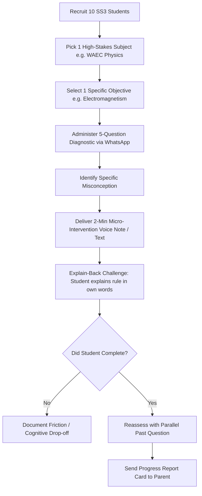

# TalkPDF — YC Office Hours Session & Lean Canvas Diagnostic

**Date:** 15 September 2026  
**Context:** Diagnostic review of `lean-canvas.pdf` (ACE Nigeria Business Model Workbook)  
**Founders / Team:** Lukman Abimbola, Andrew Thomas Kantiok, Rukayat Nurudeen  
**Facilitator:** YC Office Hours Partner / gstack

---

## 1. Executive Summary & The Stranger Test

If a complete stranger on the street asks what TalkPDF is, can they repeat it back accurately without corporate jargon?

### The Reframed Stranger Pitch:
> **"TalkPDF helps Nigerian secondary students preparing for WAEC and JAMB identify the exact concepts they don't understand, fixes those gaps by making them explain the concepts back in their own words, and shows anxious parents verifiable proof that their child is actually improving before exam day."**

### Reframed Core Pillars:
- **Target User:** SS3 secondary-school student in Nigeria cramming for high-stakes WAEC/WASSCE and JAMB exams under severe time pressure and fear of sitting at home for a gap year.
- **Target Buyer:** The parent/guardian who already pays for WAEC/JAMB registration, extra lessons, and revision books, and desperately needs visible accountability on whether the child is actually ready.
- **The Core Problem:** Past-question books and CBT software only give "Question → Answer" or percentage scores; they don't identify the conceptual root cause, verify comprehension, or show parents whether study time translates into mastery.
- **The Core Value Proposition:** A continuous diagnosis-to-verification loop: Assess → Diagnose specific topic gap → Targeted intervention → Student Explain-Back → Reassessment → Proof of gap closure delivered to the parent.
- **The Wedge:** A zero-code WhatsApp pilot testing student stamina on "Explain-Back" with 10 SS3 students on 1 subject before writing software or building platforms.

---

## 2. Original Lean Canvas Points (From `lean-canvas.pdf`)

| Canvas Block | Original Canvas Submission | Diagnostic Critique / Red Flag |
| :--- | :--- | :--- |
| **01. Problem** | Nigerian secondary students preparing for WAEC/WASSCE and JAMB study and practice questions but carry important learning gaps without knowing what they do not understand, discovered reactively via tests/poor results. | Accurate high-level pain point, but lacks the visceral consequence (failure = 1 year lost, wasted exam fees) and ignores existing workarounds (lesson centers, past question books). |
| **02. Solution** | AI-powered learning-gap resolution platform for Nigerian learners and schools; students close priority gaps earlier and enter major exams with clear evidence of knowledge. | Solution in search of a problem. Lumps students, parents, and schools together. "Learning-gap resolution platform" is educational theory jargon. |
| **03. Unique Value Proposition (UVP)** | Help Nigerian students preparing for WAEC/JAMB (supported by parents and schools) identify and close gaps via diagnosis, targeted intervention, Explain-Back verification, and reassessment in one continuous loop aligned to syllabus. | The "Explain-Back" loop is the only unique mechanic. Everything else sounds like an LMS. |
| **04. Unfair Advantage** | Sustained learner usage, high-quality curriculum mapping, validated evaluation data, tutor-quality data, and longitudinal outcome data. | **FATAL FALLACY:** Listing future scale benefits and network effects on day zero when revenue is ₦0 and users are 0. Not a day-one advantage. |
| **05. Customer Segments** | Secondary school students preparing for WAEC/JAMB in Nigeria initially, expansion to Africa. Parents and schools as supporters/decision-makers. JTBD: Identify and fix highest-priority gaps. | Mixed user (student), consumer buyer (parent), and enterprise buyer (schools). School B2B track is a dangerous distraction at stage 0. |
| **06. Key Metrics** | 10 metrics listed: Activation rate, Diagnostic completion, Gap identification rate, Intervention completion, Explain-Back participation, Reassessment completion, Gap-resolution rate, Persistent-gap rate, Learning improvement, Paid conversion. | Metrics 1–9 represent an elaborate theoretical funnel. Metric 5 (Explain-Back participation) and Metric 10 (Paid conversion) are the only two existential ones. |
| **07. Channels** | Ad/partner promotion → free diagnostic/scorecard → personalized result → account → learning-gap assessment → intervention → reassessment → subscription/tutor/referral. | Trust tactic (scorecard before paywall) is sound, but CAC and unit economics in Nigeria are brutal for low-price apps. |
| **08. Cost Structure** | COGS: ₦15,000; Ops: ₦330,000; CAC: ₦600,000; Other: ₦2,400,000; Total: ₦3,345,000. | CAC of ₦600k against ₦0 revenue assumptions. |
| **09. Revenue Streams** | Model 1: Freemium (₦0); Model 2: Subscription (₦0); Model 3: Commission (₦0). | Uncommitted pricing model. No price point tested. |

---

## 3. The Six Forcing Questions & Session Dialogue

### Question 1: Who exactly has this problem?
- **Office Hours Challenge:** Category vs. Human. A 16-year-old student doesn't have a credit card. A parent doesn't care about "learning gap algorithms"—they care about university admission. A school principal has a 9-month procurement cycle. Who writes the check, who uses it daily, and why is it called "TalkPDF"?
- **Founder Response & Alignment:**
  - **User:** SS3 student preparing for WAEC/JAMB. Daily job: Identify and fix what I don't understand before the exam.
  - **Buyer:** Parent/guardian. Parent's job: Know what the child is struggling with and whether it is improving. Payment: Parent → TalkPDF subscription → child's account.
  - **Distraction Cut:** Acknowledged that schools as a "secondary institutional buyer" must be dropped from the early wedge to focus purely on the parent-student consumer loop.
  - **Name Origin:** "TalkPDF" was inherited from an earlier prototype (PDF → Audio → Talk/Explain Back → Understanding). Brand is secondary; utility comes first.

---

### Question 2: How do you know this problem is real?
- **Office Hours Challenge:** What is observed fact vs. macro exam statistics? Have students actually talked into an AI app to explain concepts? Has a single parent paid money?
- **Founder Response & Alignment:**
  - Customer discovery interviews with secondary students and parents confirmed the emotional and academic pain of hidden learning gaps.
  - **The Raw Ground Truth:** Zero paying customers to date. Willingness to pay remains an unvalidated hypothesis.
  - Live testing of the "Explain-Back" intervention under real Nigerian conditions (erratic power, noise, data constraints, student self-consciousness) has NOT yet occurred and is the next critical product gate.

---

### Question 3: What happens if TalkPDF doesn't exist? (The Status Quo)
- **Office Hours Challenge:** If your servers never spin up, secondary school still happens. Why aren't ₦3,000 past-question booklets (*Sure Pass*, *Exam Focus*) or ₦20,000/month private home lesson teachers good enough? What breaks?
- **Founder Response & Alignment:**
  - **The Student's Current Loop:** Class lessons → Past questions / Homework → Gets stuck → Asks friend/teacher → Guesses/memorizes → Re-attempts.
  - **The Flaw in Past-Question Books:** A book only provides: *Question → Answer Key*. It cannot tell the student: *What underlying concept was misunderstood? Why did they get it wrong? What should they study next? Did they actually master it?*
  - **The Flaw in Human Tutoring:** Tutors are expensive, variable in quality, and often spend time re-teaching things the student already knows rather than surgical gap resolution.
  - **The TalkPDF Value Wedge:** Make tutoring targeted and provide the parent with visible, irrefutable accountability:
    $$\text{Diagnostic} \longrightarrow 3 \text{ Gaps Found} \longrightarrow 2 \text{ Interventions} \longrightarrow 1 \text{ Verified Closed} \longrightarrow \text{Score: } X \to Y$$

---

### Question 4: Who else is already solving it? (Competitive Reality)
- **Office Hours Challenge:** You dismissed competition in the canvas. What about **TestDriller** (cheap, 100% offline CBT, topic analytics), **uLesson** (massive funded brand, animated lessons, live chat tutors, parent SMS), and **ChatGPT / WhatsApp bots**?
- **Founder Response & Alignment:**
  - **TestDriller:** Dominates exam preparation via offline CBT drilling and topic analytics (*"Know what you got wrong"*). TalkPDF must move from performance diagnosis to an *intervention-and-verification loop*.
  - **uLesson:** Dominates curriculum content, video lessons, and parent brand. TalkPDF positions not as a content library, but as the *system of record for unresolved learning gaps and their resolution*.
  - **ChatGPT / Generic AI:** Flexible but stateless. It has no persistent syllabus mapping:
    $$\text{Student} \to \text{WAEC Objective} \to \text{Specific Misconception} \to \text{Intervention} \to \text{Explain-Back} \to \text{Reassessment} \to \text{Resolved}$$
  - **Moat Reality Check:** The team conceded that a "longitudinal outcome data moat" does not exist today; it is a future aspiration once thousands of learning loops are logged.

---

### Question 5: What would make a real customer say NO?
- **Office Hours Challenge:** What stops the parent from paying, and what makes a tired SS3 student abandon the loop after 3 minutes?
- **Founder Response & Alignment:**
  - **Parent Objection:** Price resistance amidst high inflation, skepticism about smartphones ("Are you studying or on social media?"), and lack of guaranteed exam outcomes.
  - **Student Objection:** Explain-Back requires high active-recall cognitive effort. Passive cramming is easy; explaining an organic chemistry reaction out loud is exhausting.
  - **Pragmatic Realization:** Neither parent willingness to pay ₦3,000–₦6,000/month nor student willingness to complete Explain-Back loops repeatedly can be assumed as facts. Both are high-risk hypotheses requiring live verification.

---

### Question 6: What are we assuming without evidence? (The Risk Hierarchy)
- **Office Hours Challenge:** Which assumption is fatal, and what is the narrowest test to run this week?
- **Founder Response & Alignment:**

#### The Ranked Assumption Hierarchy:
1. 🔴 **Explain-Back Stamina (EXISTENTIAL RISK):** If students refuse to do the active cognitive work of explaining concepts back repeatedly, the entire core loop collapses.
2. 🟠 **Modality (HIGH RISK, BUT FIXABLE):** Voice interaction may fail due to noise, data costs, or student shyness. Can pivot cleanly to: **Text → Voice notes → Asynchronous WhatsApp replies**.
3. 🟠 **Parent Dashboard Value (MODERATE RISK, ADAPTABLE):** Parents may not care about technical gap analytics; they may simply want a high-level confidence score: *"Your child is strong in 7/10 WAEC areas; 3 need attention."*
4. 🟡 **Monetization (VARIABLE):** If monthly subscriptions fail, test per-diagnostic fee (₦1,000), exam-season pass (₦5,000), or human tutor escalation commissions.
5. 🟢 **Brand / Name (LOWEST RISK):** TalkPDF may be an outdated name, but the name is completely irrelevant until the core learning loop proves value.

---

## 4. The 7-Day Zero-Code Concierge Validation Test

Before writing code, building a mobile app, or buying cloud infrastructure, execute this exact manual experiment:

### Experiment Parameters:
- **Cohort:** 10 SS3 students preparing for 2027 WAEC/JAMB and their parents.
- **Medium:** WhatsApp group / direct chat (zero software, zero app download).
- **Scope:** 1 subject (e.g., Physics or Chemistry), 1 curriculum topic, 3 scheduled sessions across 1 week.
- **Primary Success Metric:** Explain-Back Completion Rate (Target: $\ge 70\%$ of students complete all 3 cycles).
- **Secondary Success Metric:** Parent Reaction to the 1-page WhatsApp progress summary card.
- **Kill Trigger:** If $>50\%$ of students refuse or drop out of the Explain-Back step, the active-recall mechanism must be re-engineered before any app is built.

---

## 5. Session Status & Next Steps

- **Office Hours Verdict:** **DIAGNOSTIC COMPLETE — STRATEGY GROUNDED.**
- **Immediate Assignment:** Run the 10-student WhatsApp Explain-Back test. Record completion rates, actual drop-off points, and parent feedback on the scorecard.
