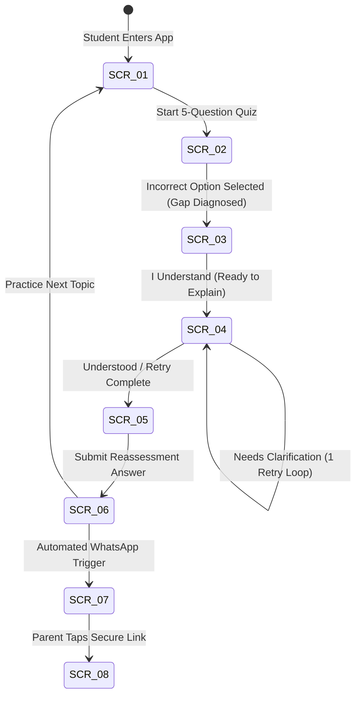

# TalkPDF — Screen Specifications

**Document Version:** 1.0.0  
**Target Milestone:** Minimum Viable Learning-Resolution Loop (SS3 WAEC/JAMB)  
**Date:** 15 September 2026  
**Reference Document:** [requirements.md](file:///c:/Users/HomePC/Documents/Talkpdf/requirements.md) | [user-flow.md](file:///c:/Users/HomePC/Documents/Talkpdf/user-flow.md)

---

## Screen Architecture Overview

To maintain extreme focus, lightweight mobile data performance, and zero user friction on entry-level Android devices, the TalkPDF MVP is organized into **8 essential screens**:

1. **SCR-01: Topic Selection & Diagnostic Setup** (Entry point)
2. **SCR-02: 5-Question Diagnostic Quiz** (Assessment)
3. **SCR-03: Likely Gap Diagnosis & Micro-Intervention** (Diagnosis & Lesson)
4. **SCR-04: Explain-Back Active Recall & Evaluation** (Recall, Evaluation & Retry)
5. **SCR-05: Parallel Reassessment Question** (Empirical Verification)
6. **SCR-06: Gap Resolution & Status Outcome** (Resolution / Persistent Gap)
7. **SCR-07: Parent WhatsApp Progress Summary** (Mobile Message View)
8. **SCR-08: Parent Detailed Web Evidence Report** (Secure Read-Only Report)

---

## Detailed Screen Specifications

### SCR-01: Topic Selection & Diagnostic Setup
* **Purpose:** Lets the student select their target exam, subject, and specific syllabus objective to launch a 5-question diagnostic quiz.
* **Elements on the Screen (Top to Bottom, Left to Right):**
  1. **Top Bar / Header:** TalkPDF logo, Student Name ("Samuel O."), and current mastery streak badge ("🔥 3 Gaps Closed").
  2. **Data-Saver Badge:** Text indicating "Low-Data Text Mode: Active" with a toggle switch.
  3. **Exam Selector Tabs:** Two toggle tabs for `WAEC / WASSCE` and `JAMB (UTME)`.
  4. **Subject Dropdown Selector:** Dropdown menu listing senior secondary subjects (`Physics`, `Chemistry`, `Biology`, `Mathematics`).
  5. **Syllabus Topic Search / List:** Search input field followed by a list of syllabus topics with objective codes (e.g., `PHY-EM-01: Electromagnetism — Faraday's Law`).
  6. **Diagnostic Launch CTA Button:** Full-width primary button labeled `"Start 5-Question Diagnostic"`.
* **Element Interactions & Transitions:**
  * Tapping **Exam Tabs**: Toggles exam mode and filters the syllabus list below.
  * Tapping **Subject Dropdown**: Updates the syllabus objectives list to the selected subject.
  * Tapping a **Syllabus Topic**: Highlights the target objective and enables the Launch button.
  * Tapping **Low-Data Toggle**: Toggles media assets off for 2G/3G data resilience (`FR-08`).
  * Tapping **Start 5-Question Diagnostic**: Caches the 5 questions locally (`FR-10`) and transitions immediately to **SCR-02 (Diagnostic Quiz)**.

---

### SCR-02: 5-Question Diagnostic Quiz
* **Purpose:** Lets the student complete 5 curriculum-linked past-exam questions in a text-first interface to isolate conceptual learning gaps.
* **Elements on the Screen (Top to Bottom, Left to Right):**
  1. **Progress Header:** Question step indicator (`Question 2 of 5`), progress bar (40% filled), and Target Topic tag (`Physics: Faraday's Law`).
  2. **Question Card:**
     * Past-exam source tag (`WASSCE 2022 Q14`).
     * Problem statement text (plain text, high contrast).
     * Optional lightweight schematic / circuit diagram (omitted if Low-Data mode is active).
  3. **Option Selection List:** Four vertical option cards labeled `A`, `B`, `C`, and `D` containing answer choices.
  4. **Navigation Footer:**
     * Secondary button: `"Previous Question"` (disabled on Question 1).
     * Primary button: `"Submit Answer"` / `"Next Question"` (disabled until an option is selected).
* **Element Interactions & Transitions:**
  * Tapping an **Option Card (A/B/C/D)**: Selects that choice with a cyan highlight border.
  * Tapping **Next Question**: Saves response locally; loads the next question.
  * Tapping **Submit Final Answer (on Question 5)**: Posts responses to server.
    * *Branch A (All 5 Correct):* Transitions to Topic Mastery summary screen.
    * *Branch B (Any Option Incorrect):* System isolates the pre-tagged misconception and transitions immediately to **SCR-03 (Likely Gap Diagnosis & Micro-Intervention)**.

---

### SCR-03: Likely Gap Diagnosis & Micro-Intervention
* **Purpose:** Shows the student their identified likely learning gap and delivers a concise 60–90 second plain-English conceptual lesson.
* **Elements on the Screen (Top to Bottom, Left to Right):**
  1. **Diagnostic Header:** Alert banner with misconception icon: `"Likely Learning Gap Identified"`.
  2. **Question Misconception Breakdown Card:**
     * The question failed (summary).
     * The option chosen vs. the correct answer.
     * Framed statement: *"You likely confused magnetic flux with the rate of change of magnetic flux."* (Tagged as probable, not definitive).
  3. **Micro-Intervention Card (60–90s Read):**
     * Subheading: *"Here is the rule you need to know:"*
     * 3-paragraph plain-English explanation of the concept (`FR-03`).
     * Highlighted Key Takeaway Box: Formula / core law statement ($\mathcal{E} = -\frac{d\Phi}{dt}$).
     * Audio Voice Snippet Player: Small play/pause button with duration (`0:45`) for audio fallback.
  4. **Action Button:** Sticky primary button: `"I Understand — Let Me Explain It Back"`.
* **Element Interactions & Transitions:**
  * Tapping **Audio Player**: Streams or plays the cached 45-second voice snippet.
  * Tapping **"I Understand — Let Me Explain It Back"**: Logs intervention consumed and transitions directly to **SCR-04 (Explain-Back Active Recall)**.

---

### SCR-04: Explain-Back Active Recall & Evaluation
* **Purpose:** Lets the student explain the concept in their own words, receive AI evaluation (`UNDERSTOOD` vs. `NEEDS_CLARIFICATION`), and access a targeted hint with one retry if needed.
* **Elements on the Screen (Top to Bottom, Left to Right):**
  1. **Prompt Header:** Challenge prompt: *"In your own simple words, explain Faraday's Law so an SS1 student could understand it."*
  2. **Active Recall Input Area:**
     * Multi-line Text Area: Auto-expanding text input with placeholder and word counter (`Min. 20 words`).
     * Voice-Note Dictation Button: Microphone icon labeled `"Record Explanation"` for speech-to-text fallback (`FR-12`).
     * Auto-Save Status: Micro-label showing `"Saved locally"` (`FR-10`).
  3. **Submission CTA Button:** Primary button labeled `"Check My Explanation"`.
  4. **Evaluation Feedback Panel (Appears dynamically post-submit):**
     * **Primary Result Banner:** Green `UNDERSTOOD` badge OR Amber `NEEDS_CLARIFICATION` badge (`FR-05`).
     * **Targeted Hint Box (Only if Needs Clarification):** Amber callout highlighting the missing required concept (e.g., *"Hint: You mentioned the coil, but forgot to explain what must happen to the magnetic field over time"*).
     * **Secondary Feedback Card:** Scores for Simplicity (`8/10`), Conceptual Accuracy (`7/10`), Analogies (`8/10`), Composite Score (`78/100`), and Badge tier (`Silver`).
  5. **Conditional Progression Buttons:**
     * If `UNDERSTOOD`: Primary button `"Proceed to Verification Question"`.
     * If `NEEDS_CLARIFICATION`: Secondary button `"Try 1 Revision (Hint Applied)"` (enables 1 retry).
* **Element Interactions & Transitions:**
  * Typing in **Text Area**: Auto-caches draft into client storage on every keystroke.
  * Tapping **"Record Explanation"**: Activates microphone for audio dictation.
  * Tapping **"Check My Explanation"**: Sends text to AI evaluation engine; renders Feedback Panel.
  * Tapping **"Try 1 Revision"**: Re-opens text area with the hint pre-pinned. Student submits second attempt; after evaluation, automatically presents `"Proceed to Verification Question"` (no further retries permitted).
  * Tapping **"Proceed to Verification Question"**: Transitions to **SCR-05 (Parallel Reassessment Question)**.

---

### SCR-05: Parallel Reassessment Question
* **Purpose:** Lets the student solve one fresh parallel past-exam question testing the identical learning objective to empirically verify gap closure.
* **Elements on the Screen (Top to Bottom, Left to Right):**
  1. **Reassessment Header:** Banner labeled `"Final Verification: Prove You've Got It"`.
  2. **Topic & Source Tag:** Tag showing `Objective: Faraday's Law` & `Source: JAMB UTME 2021 Q28`.
  3. **Parallel Question Box:**
     * Fresh problem statement testing the exact rule previously misunderstood.
     * Optional schematic/diagram (if applicable).
  4. **Multiple-Choice Option Cards:** Four selectable option buttons (`A`, `B`, `C`, `D`).
  5. **Verification Action CTA:** Primary button labeled `"Submit & Verify Gap Closure"` (disabled until an option is selected).
* **Element Interactions & Transitions:**
  * Tapping an **Option Card**: Highlights the selected answer.
  * Tapping **"Submit & Verify Gap Closure"**: Submits the response to the server, marks empirical status in the database, and transitions to **SCR-06 (Gap Resolution Outcome)**.

---

### SCR-06: Gap Resolution & Status Outcome
* **Purpose:** Displays the empirical learning-gap outcome (`PROVISIONALLY_RESOLVED` vs. `PERSISTENT_GAP`), updates mastery streaks, and provides next-step actions.
* **Elements on the Screen (Top to Bottom, Left to Right):**
  1. **Outcome Status Hero Card:**
     * **If Correct:** Green celebration banner with `PROVISIONALLY_RESOLVED` badge, updated streak indicator (`🔥 4 Gaps Closed`), and provisional notice: *"Great job! This gap is provisionally closed. A future reassessment will confirm permanent mastery."*
     * **If Incorrect:** Red alert banner with `PERSISTENT_GAP` badge: *"This concept needs extra support before exam day."*
  2. **Session Summary Stats:**
     * Diagnostic Result: `1 Gap Diagnosed`
     * Explain-Back Score: `Gold Badge (85/100)`
     * Verification Result: `Correct (JAMB 2021 Q28)` or `Incorrect`
  3. **Tutor Escalation Card (Only displayed if PERSISTENT_GAP):**
     * Message: *"Would you like a human lesson tutor to review this specific diagnosis with you?"*
     * Button: `"Request Tutor Help for this Topic"` (`FR-13`).
  4. **Parent Dispatch Notice:**
     * Text: *"A progress scorecard has been queued for your parent via WhatsApp."*
  5. **Next Topic CTA Button:** Primary button: `"Practice Next Topic"` or `"Return to Dashboard"`.
* **Element Interactions & Transitions:**
  * Tapping **"Request Tutor Help"**: Opens escalation modal; pre-attaches diagnostic record and dispatches request to tutoring coordinator (`FR-13`).
  * Tapping **"Practice Next Topic"**: Resets active session state and navigates back to **SCR-01**.

---

### SCR-07: Parent WhatsApp Progress Summary
* **Purpose:** Displays the structured progress message received by the parent directly in their WhatsApp app, providing verifiable proof of study and gap closure.
* **Elements on the Screen (Top to Bottom, Left to Right):**
  1. **WhatsApp Header Bar:** Parent's native WhatsApp interface showing sender: `TalkPDF Study Bot` with verified checkmark.
  2. **Incoming Message Bubble:**
     * **Header:** `📊 TalkPDF Exam Readiness Alert`
     * **Student Name & Target:** `Student: Samuel Okon | WAEC Physics`
     * **Topic Assessed:** `Electromagnetism: Faraday's Law`
     * **Key Metrics Summary Block:**
       * *Gaps Identified:* `1`
       * *Gaps Provisionally Resolved:* `1`
       * *Gaps Requiring Support:* `0` (or `1 Persistent Gap`)
       * *Readiness Index:* `62% ➔ 74% (+12%)`
     * **Reassessment Notice:** `Next check-in: 7 days to confirm mastery.`
     * **Secure Web Link:** Clickable secure URL: `https://talkpdf.app/r/sec-9a7d8e21c4`
  3. **WhatsApp Reply Field:** Native WhatsApp input bar (allows parent to reply with `"TUTOR"` or questions).
* **Element Interactions & Transitions:**
  * Tapping the **Secure Web Link (`https://talkpdf.app/r/...`)**: Opens the parent's mobile browser directly to **SCR-08 (Parent Detailed Web Evidence Report)** without requiring any username, password, or account setup (`FR-07`).

---

### SCR-08: Parent Detailed Web Evidence Report
* **Purpose:** Lets the parent view the full, read-only evidence report (questions failed, Explain-Back evaluation, parallel result, and tutor recommendations) via a secure, non-guessable link without logging in.
* **Elements on the Screen (Top to Bottom, Left to Right):**
  1. **Report Header:** TalkPDF verified badge, Student Name (`Samuel Okon`), Target Exam (`WAEC May/June 2027`), and Date Generated.
  2. **Security & Privacy Bar:** Notice: *"Private, read-only student evidence link. Zero student personal data exposed."*
  3. **Readiness Score Progress Card:** Visual dial showing progress change from `62%` to `74%`, with topics mastered breakdown.
  4. **Detailed Learning-Loop Audit Trail:**
     * **Step 1 (Diagnostic):** Failed Question, student's chosen option, and the diagnosed likely misconception.
     * **Step 2 (Explain-Back Active Recall):** Transcript of student's own-words explanation, AI evaluation (`UNDERSTOOD`), and secondary rubric ratings (`Simplicity 8/10, Accuracy 8/10`).
     * **Step 3 (Reassessment):** Parallel past-exam question result (`Passed: Provisionally Resolved`).
  5. **Tutor Guidance Box:** Concrete advice for the parent:
     * *If Resolved:* *"Samuel has demonstrated conceptual understanding. No paid tutoring needed on this topic."*
     * *If Persistent Gap:* *"Samuel is confusing magnetic flux. Instruct your evening lesson tutor to focus strictly on Faraday's Law."*
  6. **Footer:** Button to `"Save / Download PDF Summary"` and TalkPDF support contact link.
* **Element Interactions & Transitions:**
  * Tapping **"Save / Download PDF Summary"**: Triggers mobile browser print/PDF download of the 1-page scorecard.
  * Tapping **Support Link**: Opens WhatsApp chat with TalkPDF academic advisor.

---

## Screen Navigation & Transition Map

