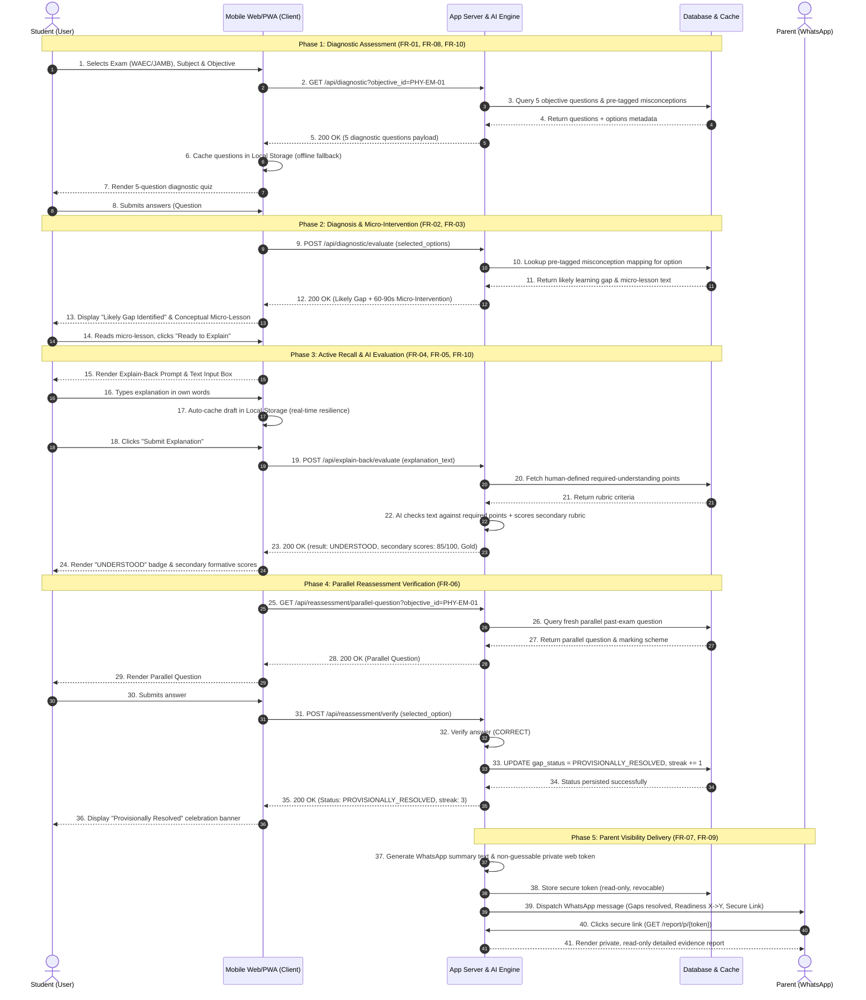

# TalkPDF — Sequence Diagrams (Data Flow Specification)

**Document Version:** 1.0.0  
**Target Milestone:** Minimum Viable Learning-Resolution Loop (SS3 WAEC/JAMB)  
**Date:** 15 September 2026  
**Reference Document:** [requirements.md](file:///c:/Users/HomePC/Documents/Talkpdf/requirements.md) | [user-flow.md](file:///c:/Users/HomePC/Documents/Talkpdf/user-flow.md)

---

## 1. Main Flow: Complete Learning-Resolution Loop (`PROVISIONALLY_RESOLVED`)

This sequence diagram illustrates the full end-to-end data exchange between the **Student (User)**, the **Mobile Web/PWA App (Client)**, the **Application Server / AI Engine**, the **Database / Cache**, and the **Parent / WhatsApp Gateway** for a successful gap resolution.



---

## 2. Exception Flow: Explain-Back Clarification Retry & Persistent Gap Escalation

This sequence diagram illustrates the exception and fallback paths:
1. **Explain-Back returns `NEEDS_CLARIFICATION`** &rarr; Server issues 1 targeted hint and permits exactly 1 retry.
2. **Parallel Question is answered incorrectly** &rarr; Server transitions status to `PERSISTENT_GAP`, prompts Human Tutor Escalation (`FR-13`), and alerts the parent via WhatsApp.

```mermaid
sequenceDiagram
    autonumber
    actor Student as Student (User)
    participant App as Mobile Web/PWA (Client)
    participant Server as App Server & AI Engine
    participant DB as Database & Cache
    actor Parent as Parent (WhatsApp)

    %% Initial Explain-Back Submission
    Note over Student, Server: Exception Path A: Explain-Back Needs Clarification (FR-04, FR-05)
    Student->>App: 1. Submits incomplete explanation
    App->>Server: 2. POST /api/explain-back/evaluate (explanation_text)
    Server->>DB: 3. Fetch required-understanding points
    DB-->>Server: 4. Return criteria
    Server->>Server: 5. AI detects missing core concept (magnetic field rate of change)
    Server-->>App: 6. 200 OK (result: NEEDS_CLARIFICATION, hint: "Focus on how fast the magnet moves", retry_allowed: 1)
    App-->>Student: 7. Display "Needs Clarification", targeted hint, and retry box

    %% Single Retry Cycle
    Student->>App: 8. Enters revised explanation using hint
    App->>Server: 9. POST /api/explain-back/retry (revised_text, attempt: 2)
    Server->>Server: 10. AI re-evaluates second attempt
    Server-->>App: 11. 200 OK (Retry accepted, advance to testing)
    Note over App, Server: Maximum 1 retry enforced; flow advances directly to testing

    %% Parallel Question Failure
    Note over Student, DB: Exception Path B: Parallel Question Missed -> PERSISTENT_GAP (FR-06, FR-11, FR-13)
    App->>Server: 12. GET /api/reassessment/parallel-question
    Server->>DB: 13. Query fresh parallel question
    DB-->>Server: 14. Return parallel question
    Server-->>App: 15. 200 OK (Parallel Question)
    App-->>Student: 16. Render parallel past question
    Student->>App: 17. Solves and selects INCORRECT option
    App->>Server: 18. POST /api/reassessment/verify (selected_option)
    Server->>Server: 19. Verify answer (INCORRECT)
    Server->>DB: 20. UPDATE gap_status = PERSISTENT_GAP, streak = 0
    DB-->>Server: 21. Status updated
    Server-->>App: 22. 200 OK (Status: PERSISTENT_GAP, tutor_escalation_eligible: true)
    
    %% UI Presentation & Tutor Escalation Prompt
    App-->>Student: 23. Display "Persistent Gap Identified" & "Request Tutor Support" CTA
    opt Student requests human tutor escalation
        Student->>App: 24. Clicks "Connect with Tutor for this Gap"
        App->>Server: 25. POST /api/tutor/escalate (gap_id, diagnosis_metadata)
        Server->>DB: 26. Flag ticket for lesson tutor dispatch
    end

    %% Parent Notification of Persistent Gap
    Note over Server, Parent: Parent Alert: Unresolved Gap Flagged (FR-07, FR-09)
    Server->>Parent: 27. WhatsApp message: "Topic Electromagnetism needs lesson teacher revision. View diagnosis: [secure_link]"
    Parent->>Server: 28. Clicks secure link (GET /report/p/{token})
    Server-->>Parent: 29. Render report with targeted tutoring guidance for evening lesson teacher
```

---

## 3. Data Entities & Payload Contracts

### A. Explain-Back Evaluation Response (`POST /api/explain-back/evaluate`)
```json
{
  "status": "success",
  "data": {
    "primary_result": "UNDERSTOOD", // or "NEEDS_CLARIFICATION"
    "retry_allowed": false,
    "hint": null,
    "secondary_feedback": {
      "simplicity_score": 9,
      "accuracy_score": 8,
      "analogies_score": 8,
      "overall_score": 85,
      "badge": "GOLD"
    }
  }
}
```

### B. Reassessment Verification Response (`POST /api/reassessment/verify`)
```json
{
  "status": "success",
  "data": {
    "is_correct": true,
    "gap_status": "PROVISIONALLY_RESOLVED", // or "PERSISTENT_GAP"
    "requires_future_reassessment": true,
    "streak_count": 4,
    "parent_update_dispatched": true
  }
}
```

### C. WhatsApp Parent Message Payload
```text
TalkPDF Progress Alert:
Student: Samuel O.
Subject: Physics (WAEC)
Topic: Electromagnetism: Faraday's Law

Summary:
- Gaps Identified: 1
- Gaps Provisionally Resolved: 1
- Gaps Requiring Support: 0
- Readiness Score: 62% -> 74% (+12%)

Detailed Evidence Report (Read-only):
https://talkpdf.app/r/sec-8f4b29a1d9
```
